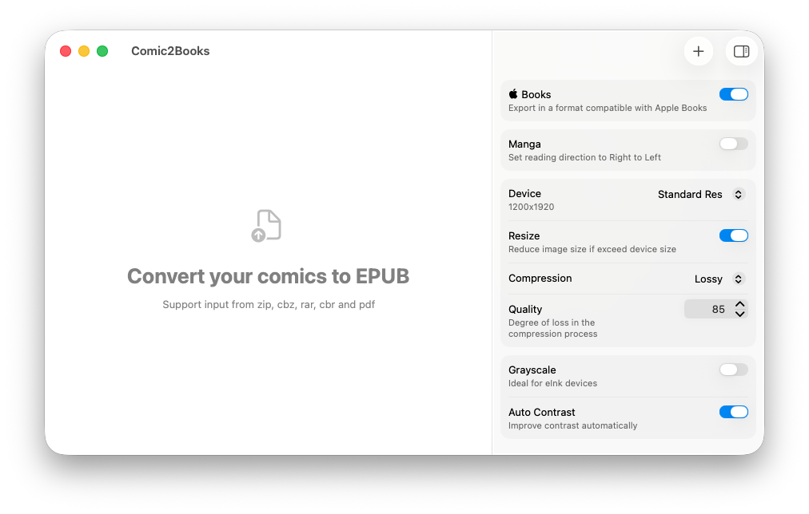

  
  <h1 align="center">Comic2Books</h1>
  

   A macOS application to convert manga and comics into EPUB format for Apple Books and other e-reader devices
  

   

> Comic2Books uses [go-comic-converter](https://github.com/celogeek/go-comic-converter) under the hood to process comics, so a special thanks goes to [Celogeek](https://github.com/celogeek)

# Features

- Support input from ZIP, CBZ, RAR, CBR, and PDF files
- Customize output image quality
- Intelligent cropping (supports removing even page numbers)
- Enhance contrast automatically or manually
- Auto-split double pages (for easy reading in portrait mode)
- Limit EPUB size for uploads via Amazon service
- Apple Books compatibility mode
